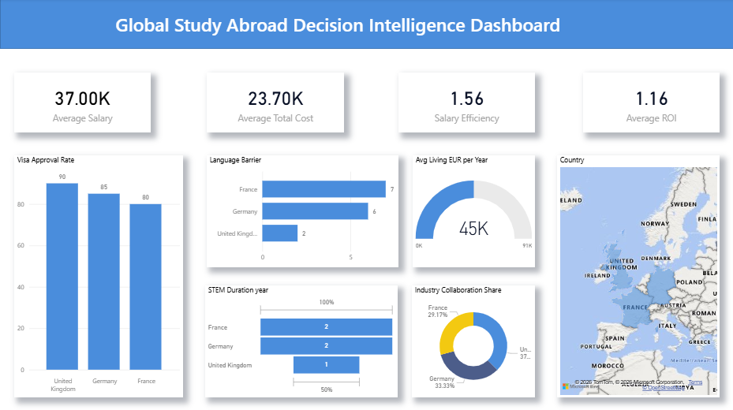
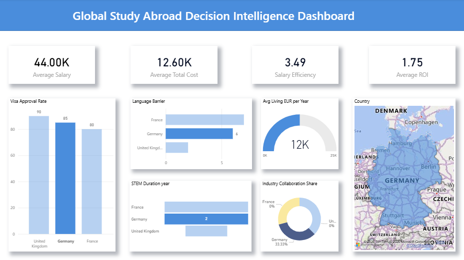
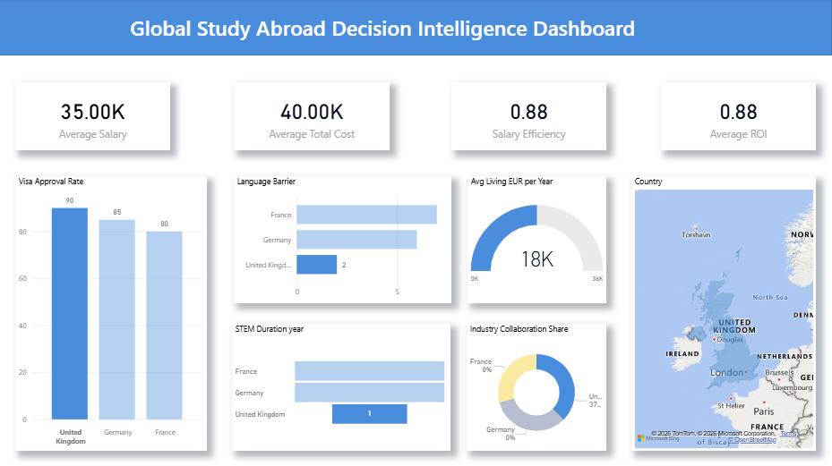
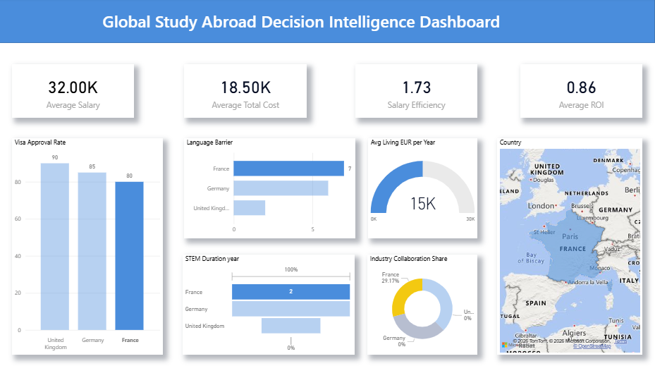

# Global Study Abroad Decision Intelligence Dashboard

## Project Overview

This project presents an interactive dashboard designed to evaluate key factors that influence international students when choosing a study abroad destination.

The dashboard integrates financial, academic, and accessibility indicators to compare major European study destinations and support data-driven decision making for higher education planning.

Using data visualization techniques, the project highlights how education investment, career outcomes, and accessibility factors vary across countries.

---

## Objective

The objective of this project is to analyze study abroad destinations and evaluate their attractiveness using measurable indicators such as:

- Tuition costs  
- Living expenses  
- Program duration  
- Expected STEM salary after graduation  
- Visa approval rates  
- Language barriers  
- Research strength  
- Industry collaboration  

The dashboard aims to answer key questions such as:

- Which country provides the best return on education investment?
- How do study costs compare across destinations?
- Which countries offer stronger career and research opportunities?
- What challenges might international students face?

---

## Countries Analyzed

The analysis focuses on three major European study destinations:

- Germany  
- United Kingdom  
- France  

These countries were selected because they represent different education models.

**Germany**

- Very low tuition costs  
- Strong engineering and STEM industries  
- High return on investment for international students  

**United Kingdom**

- Global research hub  
- Strong university–industry collaboration  
- Shorter program duration  

**France**

- Balanced education system  
- Moderate costs  
- Strong academic tradition  

This comparison highlights the trade-offs between cost, accessibility, and career outcomes.

---

## Dataset Overview

The dataset contains indicators related to education investment, academic strength, and career outcomes.

### Key Variables

| Variable | Description |
|--------|-------------|
| Avg Tuition EUR per Year | Average yearly tuition fee |
| Avg Living EUR per Year | Average yearly living expenses |
| Duration Years | Typical length of STEM programs |
| Avg STEM Salary EUR per Year | Expected salary after graduation |
| Visa Approval Rate Percent | Likelihood of visa approval |
| Language Barrier | Difficulty for international students (1–10 scale) |
| Research Strength | Academic research capability |
| Industry Collaboration | Strength of university–industry partnerships |
| Total Investment | Total study cost |
| ROI Ratio | Salary return relative to education investment |

---

## Data Preparation and Calculations

Several derived indicators were calculated to evaluate study destination attractiveness.

### Total Investment

Total education investment represents the full financial cost of completing a degree.

Calculation:

Total Investment = (Tuition + Living Cost) × Program Duration

Example:

Germany  
(300 + 12,300) × 2 = **25,200 EUR**

United Kingdom  
(22,000 + 18,000) × 1 = **40,000 EUR**

France  
(3,500 + 15,000) × 2 = **37,000 EUR**

---

### KPI Metrics

The dashboard includes several key indicators.

**Average Total Cost**

Represents the average yearly cost of studying abroad, combining tuition and living expenses.

**Average Salary**

Shows the expected annual salary for STEM graduates after completing their degree.

**Average ROI**

Return on Investment measures how effectively education investment converts into salary outcomes.

**Salary Efficiency**

Compares expected salary with study costs, indicating the financial efficiency of studying in each destination.

---

## Tools Used

- Microsoft Power BI  
- Data modeling  
- Data cleaning and transformation  
- Data visualization  
- Analytical dashboard design  

---

## Dashboard Features

### KPI Metrics

The dashboard highlights key financial indicators:

- Average STEM Salary  
- Average Total Cost  
- Salary Efficiency  
- Average ROI

---

### Visualizations Included

**Visa Approval Rate (Bar Chart)**  
Compares visa success rates across countries.

**Language Barrier Analysis (Horizontal Bar Chart)**  
Shows the difficulty level for international students.

**Average Living Cost Gauge**  
Displays the relative cost of living for students.

**STEM Program Duration Chart**  
Compares study duration across countries.

**Industry Collaboration Distribution (Donut Chart)**  
Shows how strongly universities collaborate with industries.

**Country Map**  
Displays geographic locations of study destinations.

---

## Key Insights

- Germany offers the strongest ROI due to low tuition fees and strong STEM salary outcomes.
- The United Kingdom has the highest visa approval rate, making it one of the most accessible destinations.
- France presents moderate investment costs but lower salary outcomes compared to Germany.
- Program duration differs significantly, with UK programs typically lasting one year, while Germany and France programs usually last two years.
- Strong industry collaboration in the UK supports better internship and employment opportunities.

---

## Analytical Focus

This dashboard demonstrates:

- Education investment analysis  
- Return on investment evaluation  
- Cross-country study destination comparison  
- Academic ecosystem assessment  
- International student accessibility analysis  

---

## Dashboard Previews

### Dashboard Overview

**Key Insights**

- The average STEM salary across the three countries is approximately 32K EUR, while the average study cost is about 18.5K EUR.
- The average ROI ratio is 0.86, indicating variation in salary outcomes depending on the destination.
- Visa approval rates remain relatively high across all countries (80–90%).
- Differences in tuition and living costs significantly affect total education investment.

---

### Germany Analysis

**Key Insights**

- Germany offers the highest salary potential (around 44K EUR) while maintaining the lowest average study cost (about 12.6K EUR).
- This leads to the highest salary efficiency and ROI among the analyzed countries.
- Strong research capability and industry collaboration support career opportunities in engineering and technology sectors.
- Language barriers may still exist for some international students.

---

### United Kingdom Analysis

**Key Insights**

- The UK shows the highest visa approval rate (around 90%), indicating strong accessibility.
- It also has the highest total education investment due to expensive tuition and living costs.
- STEM salary outcomes are moderate relative to the high investment, resulting in a lower ROI.
- Strong research ecosystems and industry partnerships support employment opportunities.

---

### France Analysis

**Key Insights**

- France has a moderate investment cost compared to the UK.
- Salary outcomes are lower than Germany, resulting in lower salary efficiency.
- Language barriers are higher compared to the UK, which may affect accessibility.
- The country maintains strong academic and research traditions.

---

## Practical Applications

This project can support:

- Students comparing study abroad destinations  
- Education consultants advising international applicants  
- Researchers analyzing international education competitiveness  
- Universities evaluating factors influencing international student choices  

The dashboard provides a structured framework for evaluating study abroad decisions using data-driven insights.

---

## How to Use

1. Review the KPI metrics to understand overall financial indicators.
2. Compare education investment across countries.
3. Evaluate salary outcomes relative to study costs.
4. Analyze visa accessibility and language barriers.
5. Assess research strength and industry collaboration.

---

## Conclusion

Choosing a study destination involves balancing cost, career outcomes, academic strength, and accessibility factors.

By integrating these indicators into a single analytical dashboard, this project demonstrates how data visualization can support more informed decision-making for international education planning.

---

## Author

Lakshaya S

---

## Project Type

Data Analytics | Business Intelligence | Education Decision Intelligence
